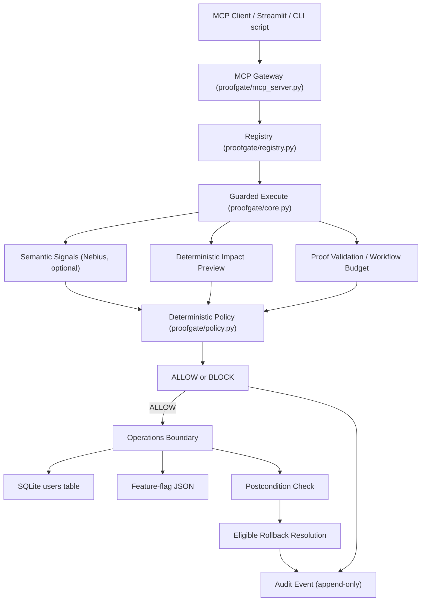
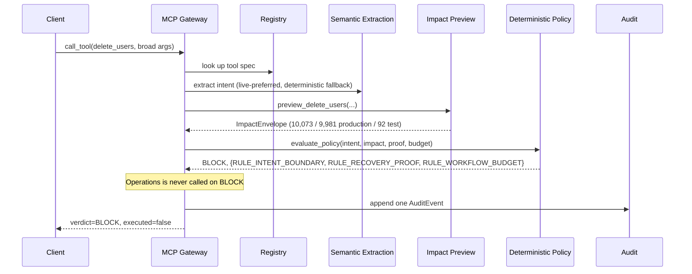
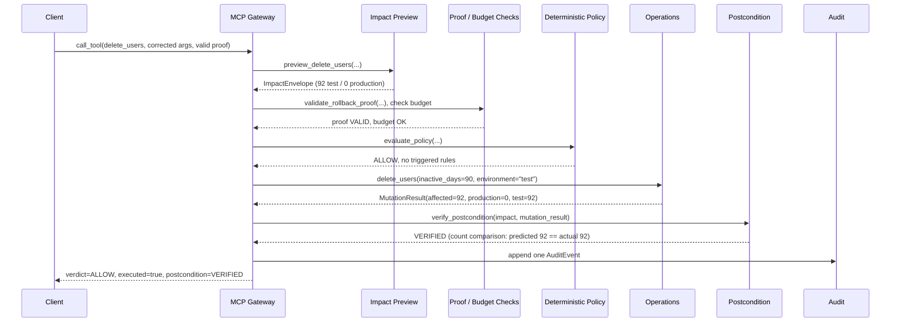
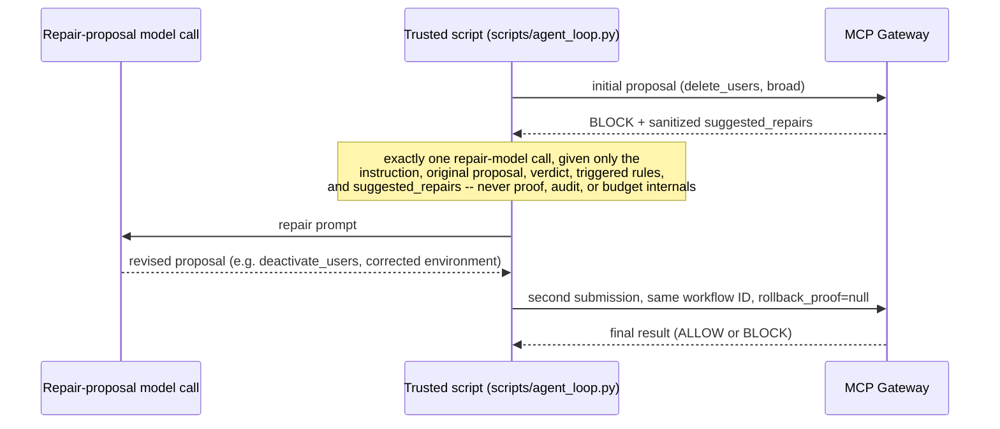
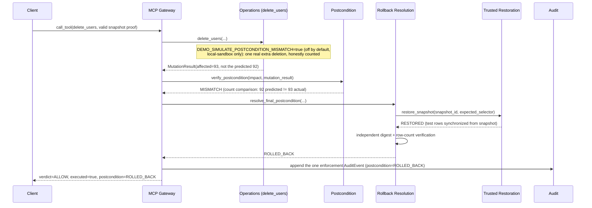

# Architecture

This document describes the real, implemented system: what each component
does, what it is not allowed to do, and how a request actually flows through
it. Every diagram here matches the current code, not an aspirational design.

## System diagram

### Component responsibilities

**Nebius (semantic extraction only)**
- May identify structured intent and risk signals from the free-text
  instruction (`environment`, `inactivity_days`, mismatch/scope-class
  features).
- Does **not** calculate authoritative impact.
- Does **not** issue the verdict.
- Live-preferred with a deterministic regex fallback on any failure,
  malformed response, or missing configuration.

**CRAFT (read-only evidence, optional)**
- A separate, explicitly user-triggered enterprise-schema/cohort-evidence
  source, rendered in Streamlit under an honest "CRAFT enterprise
  evidence" / "Previously retrieved CRAFT evidence" label.
- Does **not** authorize actions.
- Does **not** issue the verdict.
- Never called from the MCP gateway or from any test.

**Deterministic code (the only authority)**
- Calculates impact (`operations/actions.py`, `operations/feature_flags.py`).
- Validates proof (`proofgate/proofs.py`).
- Checks workflow budget (`proofgate/budgets.py`).
- Evaluates policy (`proofgate/policy.py`) -- the sole ALLOW/BLOCK authority.
- Executes Operations mutations, only after a genuine ALLOW.
- Verifies postconditions (`proofgate/postcondition.py`).
- Decides rollback eligibility and resolves the final postcondition status
  (`proofgate/rollback.py`).
- Writes exactly one audit event per governed call (`proofgate/audit.py`).

### Postcondition accuracy note

Two genuinely different mechanisms exist, and this document (and the rest
of the repository) is careful never to conflate them:

- **Normal postcondition verification** (`proofgate/postcondition.py::
  verify_postcondition`) compares the deterministic preview's predicted
  count against the mutation's own honestly-reported actual count. It is
  a **count comparison**, not a digest comparison, and it never re-queries
  the database.
- **Rollback's independent restoration verification**
  (`proofgate/rollback.py::resolve_final_postcondition`) is a separate,
  additional mechanism that only runs when normal verification reports
  `MISMATCH` on a rollback-eligible action. It recomputes a row-content
  digest and row counts directly from the snapshot artifact and compares
  them to the post-restoration database state -- this is where digest
  comparison actually happens.

## Sequence: BLOCK

## Sequence: ALLOW

## Sequence: one-shot repair

Invariants: at most one repair-model call per workflow; at most two MCP
submissions per workflow; the same workflow ID is reused for both; no
proof is fabricated or attached by the repair path; suggested repairs are
never authoritative -- only the deterministic policy's own re-evaluation
of the repaired request decides the second verdict.

## Sequence: automatic rollback

Facts worth stating plainly:
- The mismatch mechanism is deterministic, local, off by default, and
  exists only to demonstrate genuine mismatch detection -- it performs a
  real extra database mutation and never fabricates `PostconditionResult`.
- Workflow budget is charged once, from the real total mutation
  (`93/100`, not `92/100`) -- rollback does not refund it.
- Failed restoration or failed independent verification produces
  `MANUAL_REVIEW_REQUIRED`, never a false `ROLLED_BACK`.
- Exactly one enforcement audit event represents the whole call; rollback
  never appends a second, fake enforcement decision.
